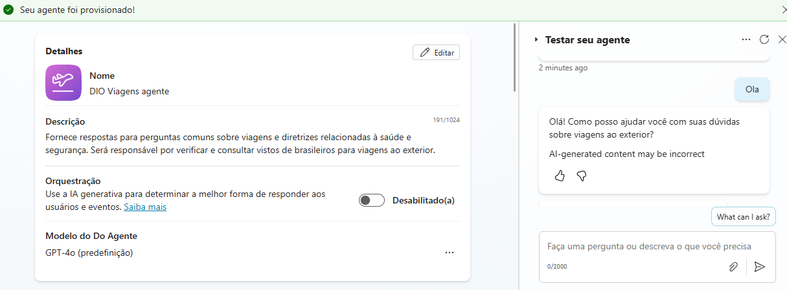

# Criando o primeiro Copiloto no Microsoft Copilot Studio

Este repositório contém o passo a passo do desafio **Criando seu primeiro Copiloto** no Microsoft Copilot Studio, baseado no modelo **Viagens Seguras**.

---

## Documentação do Modelo

Para mais detalhes sobre o modelo **Viagens Seguras**, consulte a [documentação oficial](https://go.microsoft.com/fwlink/?linkid=2271279).

---

## Passos do Desafio

1. **Página inicial do modelo Viagens Seguras**  
   - Iniciamos explorando a interface do modelo e entendendo suas funcionalidades.

2. **Criar um agente baseado no modelo Viagens Seguras**  
   - Criamos um agente funcional a partir do modelo, com respostas automáticas a perguntas sobre viagens.  
   - Exemplo de interação:  
     - Pergunta: "Olá"  
     - Resposta do agente: "Olá, como posso ajudar você com suas dúvidas sobre viagens ao exterior?"

3. **Criar um agente em branco**  
   - Iniciamos um agente do zero no Copilot Studio para testes e aprendizado.

---

## Conteúdo Prático

- **Resumo do aprendizado:**  
  - Familiarização com o ambiente do Microsoft Copilot Studio.  
  - Criação e configuração de um agente baseado em modelo e de um agente em branco.  
  - Teste de interações básicas com o modelo **Viagens Seguras**.

---

## Imagens

### Página inicial do modelo Viagens Seguras

### Agente baseado no modelo Viagens Seguras

### Criando o agente em branco

---

## Conclusão

Este desafio permite que você tenha uma primeira experiência prática com o Microsoft Copilot Studio, criando agentes funcionais e entendendo o fluxo de interações com usuários.
