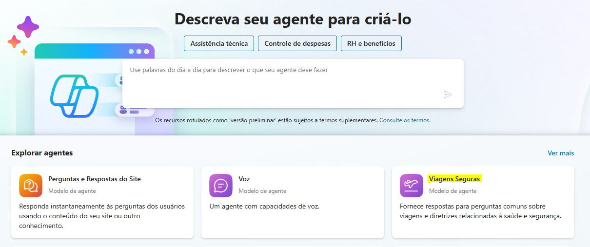
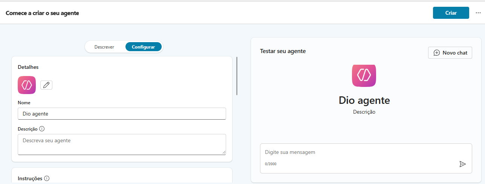

# Criando seu primeiro Copiloto no Microsoft Copilot Studio

Este repositório contém o passo a passo do desafio **Criando seu primeiro Copiloto** no Microsoft Copilot Studio, baseado no modelo **Viagens Seguras**.

---

## Documentação do Modelo

Para mais detalhes sobre o modelo **Viagens Seguras**, consulte a [documentação oficial](https://go.microsoft.com/fwlink/?linkid=2271279).

---

## Passos do Desafio

1. **Criar um agente em branco**  
   - Iniciamos criando um agente do zero no Copilot Studio.

2. **Entender o desafio**  
   - O objetivo é explorar o Microsoft Copilot Studio e criar seu primeiro Copiloto.

3. **Explorar a demonstração**  
   - Testamos o agente criado com interações básicas, por exemplo:  
     - Pergunta: "Olá"  
     - Resposta do agente: "Olá, como posso ajudar você com suas dúvidas sobre viagens ao exterior?"

---

## Conteúdo Prático

- **Resumo do aprendizado:**  
  - Familiarização com o ambiente do Microsoft Copilot Studio.  
  - Criação e configuração de um agente em branco.  
  - Teste de interações básicas com o modelo **Viagens Seguras**.

---

## Imagens

### Página inicial do modelo Viagens Seguras

### Criando o agente em branco

---

## Conclusão

Este desafio permite que você tenha uma primeira experiência prática com o Microsoft Copilot Studio, criando um agente funcional e entendendo o fluxo de interações com usuários.

---

## Repositório

- Para ver o agente em funcionamento e explorar mais exemplos, acesse o repositório no GitHub:  
  `[Link do seu repositório]`
